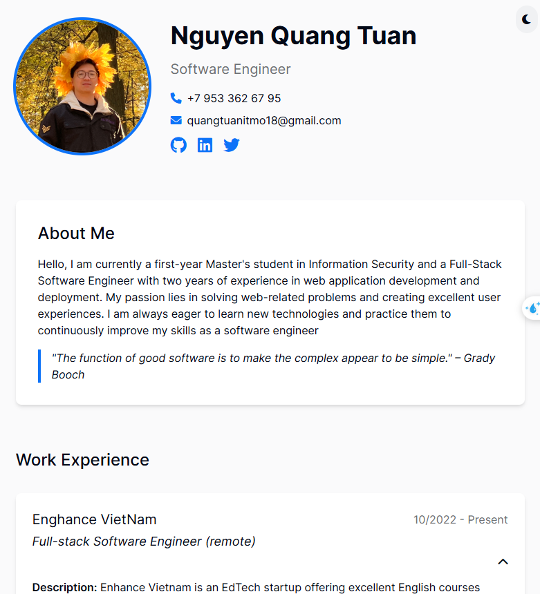

# Portfolio-TuanDev-lab1-WAD-2025

This project is a personal portfolio website built with HTML, Alpine.js, and Tailwind CSS that serves as a static profile page about yourself. It showcases personal information, work experience, education, projects, skills, and hobbies. Additionally, an ExpressJS backend is used to serve the frontend and, by leveraging a template engine, dynamically render the profile page. The project demonstrates both basic methods of serving static assets and advanced methods of rendering dynamic content, providing flexibility and ease of customization.

<a href="https://quangtuanitmo18.github.io/Profile-Page-Lab1-WAD/">Link github page</a>

  

---

## Features

- **Dark Mode:**  
  Toggle dark mode using Alpine.js and localStorage.
- **Responsive Design:**  
  Utilizes Tailwind CSS (via CDN) for a responsive layout.
- **Interactive Sections:**  
  Expandable details for work experience and projects using Alpine.js.
- **Iconography:**  
  Uses FontAwesome (via CDN) for icons.
- **Static Profile Page:**  
  A static HTML and CSS profile page with a heading, text, image, etc.
- **Backend Serving (ExpressJS):**
  - **Basic:** Serve static profile page at the default route (`/`) along with static assets (CSS, images).
  - **Advanced:** Render the profile page dynamically using EJS with parameters at `/profile` and redirect the default route (`/`) to `/profile`.

---

## Technologies Used

- **Frontend:**

  - **HTML5 & CSS3:** Markup and styling for the profile page.
  - **Tailwind CSS:** For designing a responsive layout (loaded via CDN).
  - **Alpine.js:** For interactive UI components (loaded via CDN).
  - **FontAwesome:** For icons (loaded via CDN).

- **Backend:**
  - **ExpressJS:** For serving static files and dynamic content.
  - **EJS:** (Optional for advanced part) Template engine for dynamic rendering.
